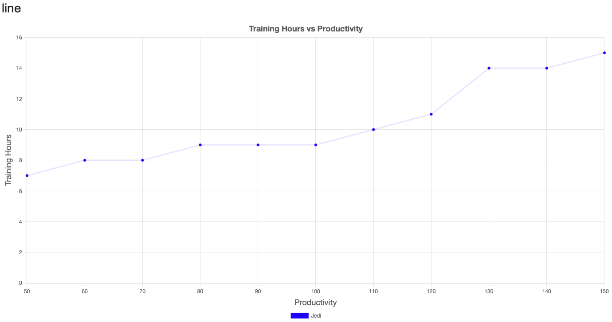
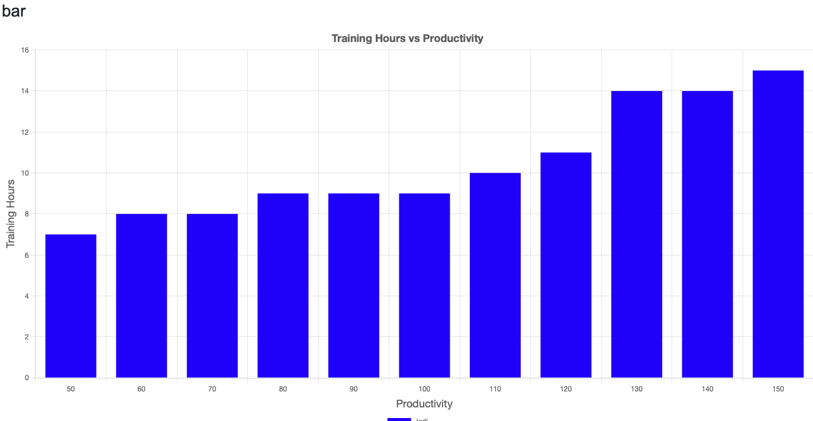
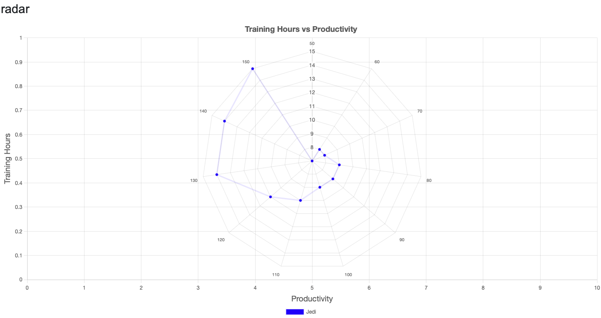
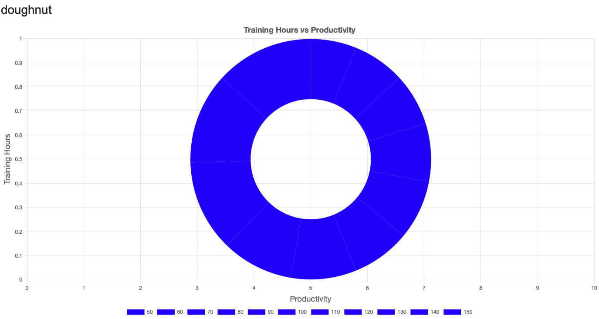
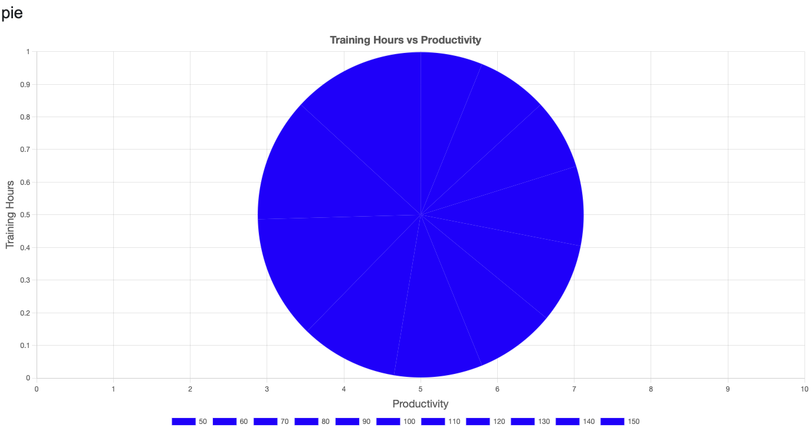
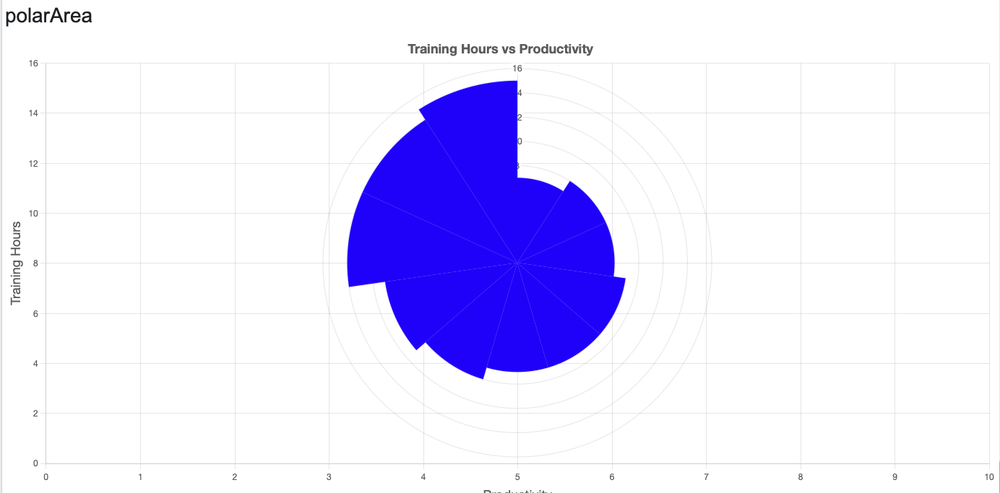
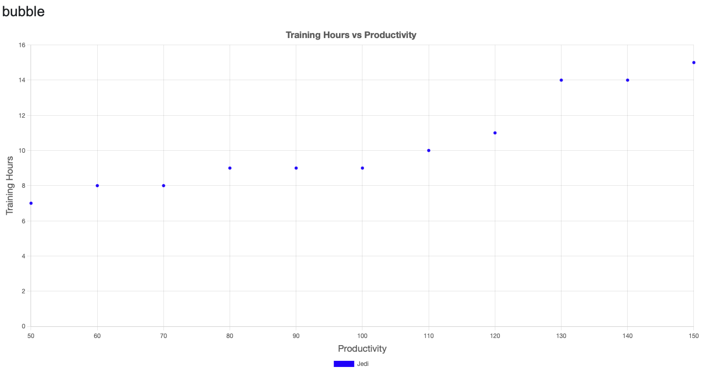
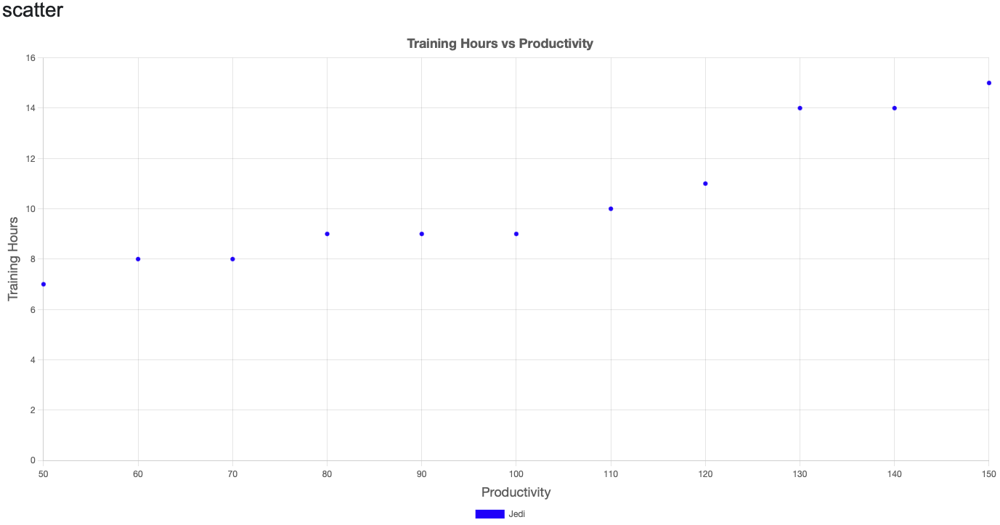

# php-chart.js

### Summary

PHP Loop to generate each Chart Type.

This PHP script returns an array, [ $js, $charts ], which can then be placed on a page.

```php
<?php
  $js = []; // Array of Javascript
	
	// Chart Values
	$js[] = <<<JS
const xValues = [50,60,70,80,90,100,110,120,130,140,150];
const yValues = [7,8,8,9,9,9,10,11,14,14,15];
JS;
	
	$charts = 'Showing the same Chart Data with different Types. Some Types do not apply to the Data.';
	$chartTypes = [ 'line', 'bar', 'radar', 'doughnut', 'pie', 'polarArea', 'bubble', 'scatter' ];
	foreach ( $chartTypes as $chartType ) {
		$charts .= "<h3>{$chartType}</h3>";
		$charts .= "<canvas id='chartDiv_{$chartType}' style='width:100%;'></canvas>";
		$js[] = <<<JS
new Chart("chartDiv_{$chartType}", {
  type: "{$chartType}",
  data: {
    labels: xValues,
    datasets: [{
        label: "Jedi",
        fill: false,
        lineTension: 0,
        backgroundColor: "rgba(0,0,255,1.0)",
        borderColor: "rgba(0,0,255,0.1)",
        data: yValues
    }]
  },
  options: {
  responsive: true,
  maintainAspectRatio: true,
  aspectRatio: 2,
  plugins: {
    title: {
      display: true,
      text: 'Training Hours vs Productivity',
      font: { size: 18 }
    },
    legend: {
      display: true,
      position: 'bottom'
    }
  },
  scales: {
    x: {
      title: {
        display: true,
        text: 'Productivity',
        font: { size: 18 }
      }
    },
    y: {
      beginAtZero: true,
      title: {
        display: true,
        text: 'Training Hours',
        font: { size: 18 }
      }
    }
  }
}
});
JS;
	}
	
return [ $js, $charts ];
	
}
?>
```

























